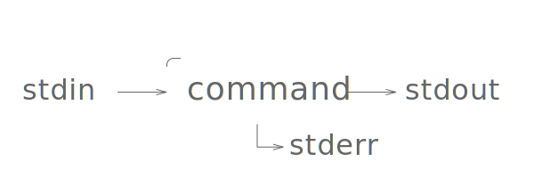

# hepl-rsv/terminal

> Introduction course to the command line.

* * *

**Note:** the school where the course is given, the [HEPL](http://www.provincedeliege.be/hauteecole) from Liège, Belgium, is a french-speaking school. From this point, the instruction will be in french. Sorry.

* * *

**Note 2 :** certains puristes tombés ici par hasard pourraient avoir à redire sur l'approche et la méthode. Sachez que ce cours est destiné à des étudiants qui n'ont rien d'informaticiens, et qui n'auront de la ligne de commande qu'un approche d'utilisateur régulier _mais_ non-expert.  
Les plus intéressés apprendront les détails par eux-même, et le contenu de ce cours est suffisant pour couvrir les besoins pour le reste des cours.  
Si malgré tout, quelque chose vous chiffonne, n'hésitez pas à créer une **issue GitHub** qu'on puisse en discuter. Un grand merci.

* * *

## Réseaux & Serveurs : Introduction à la ligne de commande

### Introduction

Quand j'ai débuté dans le web, il était impensable d'avoir un jour besoin d'utiliser un terminal ; taper des lignes de commandes, c'était réservé aux informaticiens et administrateurs serveurs, _Dieu nous en préserve…_

Mais d'une part, ce cours se nomme **Réseaux & Serveurs** (ça tombe bien), et d'autre part, avec tous les _frameworks_ et outils actuels, il n'est pas rare de commencer un projet avec une petite ligne de commande de mise en place, ce que vous avez peut-être déjà dû faire (ou ferez dans un futur proche).  
Le présent cours a donc pour but de vous donner toutes les bases nécéssaires pour vous y retrouver, et ne pas vous limiter à _copier/coller_ des commandes toutes faites sans les comprendre (ce qui est très souvent assez dangereux avec ce genre d'outils).

> **Note :** toutes les notes qui suivent sont données à titre de référence, mais, comme d'habitude, tout sera détaillé oralement pendant le cours.  
> Si vous souhaitez une référence pratique à consulter au quotidien, je vous conseille le [**Mémento Unix/Linux**, aux éditions Eyrolles](http://www.eyrolles.com/Informatique/Livre/memento-unix-linux-9782212133066), et si vous voulez creuser la question, je vous recommande l'excellent [**Parlez-vous Shell ?**, aux éditions Ellipses](http://www.editions-ellipses.fr/product_info.php?products_id=8981).

### Démarrage

Pour les besoins du cours, nous allons travailler dans deux contextes : directement sur le serveur de développement de l'école, _via_ **ssh** (dont nous avons parlé aux cours prédédents) ; et localement, sur vos propres machines.  
Dans ce cas, il vous faudra ce qu'on appelle un **terminal** (ou plutôt un _émulateur de terminal_, pour les puristes).  
Ceux d'entre vous qui sont sur Mac ont déjà un programme installé, nommé **Terminal** (dans _Applications_ > _Utilitaires_) ; tandis que sur Windows, il vous faudra installer **git bash**, livré [avec l'installeur de git](https://git-for-windows.github.io).  
Dans les deux cas, vous trouverez plus d'informations à ce sujet sur la [toolbox](https://github.com/hepl-web/toolbox/blob/master/app/divers.md#terminal).

### Vocabulaire de base

#### Console / Interface en ligne de commande

Lorsque vous utilisez un ordinateur, vous utilisez ce qu'on appelle une **interface graphique** : vous demandez à votre ordinateur d'effectuer des tâches *via* des fenêtres, des boutons et des champs de texte.  
À l'opposé de l'interface graphique se trouve l'**interface en ligne de commande** (_command line interface_ en anglais), ou **console**.  
Ici, pas d'interface graphique, tout se fait en **texte** : vous tapez des **commandes**, et l'ordinateur affiche le résultat de leur exécution.

#### Terminal

Historiquement, un **terminal** était un ordinateur accédant à un réseau. Par extension, le terme en est venu à désigner le programme permettant d'accéder à la console (plus d'informations à ce sujet sur l'[article dédié de la wikipédia](https://fr.wikipedia.org/wiki/Terminal_informatique)).

#### Émulateur de terminal

Un émulateur de terminal est un logiciel qui "simule" une console, dans une fenêtre graphique. En règle générale, quand on utilise la console depuis une interface graphique comme macOS ou Windows, on le fait _via_ un émulateur de terminal.  
**Note:** sous macOS et certaines versions de linux, l'émulateur de terminal s'appelle "Terminal", histoire d'embrouiller encore un peu plus le monde. 😓

#### Shell

En simplifiant très fort, le **shell** (ou _interpréteur de commandes_ est le _programme_ qui s'occupe de l'interface de la ligne de commande : il traite les commandes (éventuellement les corrige), et s'occupe de l'affichage des résultats.  
Il en existe une floppée (`bash`, `zsh`, `fish`, `cmd.exe`, `powershell`), certains offrant des services de complétion des commandes, de raccourcis, de gestion d'historique, correction prédictive et j'en passe.  
Dans le cadre du cours, nous utiliserons [bash](https://fr.wikipedia.org/wiki/Bourne-Again_shell), le shell le plus commun sur les systèmes UNIX/Linux.

#### Invite de commande

Lorsque vous utilisez un shell, le programme affiche ce qu'on appelle une **invite de commande** : un petit morceau de texte _invitant_ à taper votre commande à sa suite.  
Aussi appelé **prompt**, il apparaît donc après chaque commande pour taper la suivante.  
Par défaut, le prompt affiche le *nom de l'utilisateur connecté*, suivi de sa *position dans l'arborescence* des fichiers, et enfin le signe `$`, qui indique traditionnellement la fin du prompt.

> **Note :** dans la suite de ce document, tout bloc de code commencant par un `$` signifie que la suite est une commande à entrer dans votre console. Le signe dollar ne fait bien sûr par partie de la commande en question.

Le prompt peut être personnalisé et agrémenté de toutes sortes d'informations utiles. Pour quelques exemples, je vous invite à consulter la [galerie de thèmes de OhMyZsh](https://zshthem.es/all/), un outil qui permet (entre autres) de configurer son prompt sous zsh.

### Structure de base d'une commande

	$ command -f -b 12 --long-flag arg1 arg2…

Une commande se décompose en trois parties :

1. la commande
2. les options
3. les arguments

Une commande peut-être un mot-clé ou petit programme fourni par le système, ou un programme tiers qui a requis une installation.

Certaines commandes peuvent recevoir des options, qui sont exprimées (la *plupart* du temps) sous la forme de _flag_, qui peuvent être **courts** (une lettre précédée d'un tiret, comme `-v`) ou **longs** (un mot précédé de deux tirets, comme `--version`). Ces options peuvent parfois recevoir des valeurs, indiquées directement après l'option, ou avec le signe égal.

Certaines commandes peuvent recevoir des arguments, qui sont exprimés en fin de ligne, et désignent souvent la cible de la commande.

### Obtenir de l'aide

La plupart des commandes ont une documentation, accessible via la commande `man` (pour _manuel_).

	$ man ssh

> **Note :** pour fermer une page man, tapez simplement sur `q`.

Ou parfois via le flag `-h` ou `--help`, si `man` ne retourne rien.

### Connexion à un serveur distant

Pour commencer, nous allons travailler sur le serveur de l'école, pour lequel vous avez reçu (ou allez recevoir) un *login*, un *password* et l'*adresse du serveur*.   
Nous allons donc utiliser **ssh** (Secure SHell) pour ouvrir un shell sur un serveur distant.

#### Vérifier l'accessibilité du serveur

Avant même de se connecter, il convient de s'assurer que notre serveur est bien en ligne. Pour cela, vous avez la commande **ping**, qui permet d'envoyer une petite requête vers une adresse et mesurer son temps de réponse (un peu comme un sonar de sous-marin). Les _gamers_ connaissent déjà cette notion, et la commande ping permet de tester et mesurer le temps de réponse d'un serveur (ce qu'on appelle la **latence**) pour s'assurer de l'état de la connexion entre votre machine et le serveur cible.  
Bien entendu, on s'attend à avoir un temps de latence le plus petit possible.

Nous allons lancer la commande suivante :

	$ ping [SERVER_ADDRESS]

Vous devriez voir ce genre de réponse :

	PING [SERVER_ADDRESS] ([SERVER_IP]): 56 data bytes
	64 bytes from [SERVER_IP]: icmp_seq=0 ttl=53 time=12.823 ms
	64 bytes from [SERVER_IP]: icmp_seq=1 ttl=53 time=12.296 ms
	64 bytes from [SERVER_IP]: icmp_seq=2 ttl=53 time=13.280 ms
	64 bytes from [SERVER_IP]: icmp_seq=3 ttl=53 time=12.793 ms
	64 bytes from [SERVER_IP]: icmp_seq=4 ttl=53 time=11.803 ms
	64 bytes from [SERVER_IP]: icmp_seq=5 ttl=53 time=11.923 ms
	64 bytes from [SERVER_IP]: icmp_seq=6 ttl=53 time=11.284 ms
	64 bytes from [SERVER_IP]: icmp_seq=7 ttl=53 time=12.241 ms
	64 bytes from [SERVER_IP]: icmp_seq=8 ttl=53 time=12.714 ms
	64 bytes from [SERVER_IP]: icmp_seq=9 ttl=53 time=11.635 ms

C'est bien, le ping est bon, mais la commande ne s'arrête pas ! En effet, par défaut, ping tourne indéfiniment, et nous devons l'arrêter pour recevoir quelques statistiques sur notre session de ping.

> Pour arrêter une commande, utilisez la séquence de touche `ctrl`+`c`.

La commande ping devrait s'arrêter et vous afficher des statistiques comme ceux-ci :

	--- [SERVER_ADDRESS] ping statistics ---
	10 packets transmitted, 10 packets received, 0.0% packet loss
	round-trip min/avg/max/stddev = 11.284/12.279/13.280/0.593 ms

On a donc le nombre de paquets de données envoyés, le nombre de paquets reçus par le serveur, le pourcentage de pertes, suivi de quatre statistiques utiles, toutes exprimées en millisecondes.

1. le plus petit score (le *meilleur*)
2. le score moyen
3. le plus haut score (le *moins bon*)
4. l'[écart type](https://fr.wikipedia.org/wiki/%C3%89cart_type)

La commande ping peut recevoir une option (`-c`) pour préciser le nombre de paquets à envoyer puis s'arrêter automatiquement.

	$ ping -c 4 [SERVER_ADDRESS]

#### Connexion au serveur

Par défaut, **ssh** se connecte via le port `22`. Le serveur de l'école étant configuré pour que ssh écoute sur le port 22, nous n'avons pas besoin de le préciser.

Par contre, par défaut, ssh essaie de se connecter à un serveur distant en utilisant *votre nom d'utilisateur actuel*. Celui-ci ne concordant pas avec celui de votre compte sur le serveur de l'école, nous allons devoir manuellement l'indiquer, avec l'option `-l [LOGIN]`.

Notre commande de connexion sera donc la suivante :

	$ ssh -l [LOGIN] [SERVER_ADDRESS]

La connexion devrait s'établir et ssh va vous demander votre mot de passe.  
**ATTENTION :** sur la plupart des shell, quand un mot de passe est demandé, les caractères entrés ne sont pas affichés à l'écran : c'est donc *tout à fait normal* de ne rien voir pendant que vous taper votre mot de passe.

**Note :** lors de la première connexion à un serveur, ssh va vous poser une question de routine sur la sécurité de la connexion au serveur donné. Validez en tapant "`yes`".

Si tout se passe bien, vous devriez avoir un petit message de bienvenue, suivi de votre invite de commande, qui devrait ressembler à ceci :

	Linux SERVER_NAME 3.2.0-4-amd64 #1 SMP Debian 3.2.65-1+deb7u2 x86_64

	The programs included with the Debian GNU/Linux system are free software;
	the exact distribution terms for each program are described in the
	individual files in /usr/share/doc/*/copyright.

	Debian GNU/Linux comes with ABSOLUTELY NO WARRANTY, to the extent
	permitted by applicable law.
	Last login: Thu Oct  6 14:41:47 2016 from 82.212.176.7
	userXX@SERVER_NAME:~$

### Effacer le contenu de l'écran

Avant d'aller plus loin, faisons un peu de ménage. Si vous vous sentez perdu devant l'encombrement d'informations sur la console, la commande `clear` permet d'effacer le contenu de l'écran, histoire d'y revoir clair à nouveau.

	$ clear

### Arborescence et navigation

Comme vous le savez probablement déjà, les fichiers présent sur un ordinateur sont organisés sous forme d'une **arborescence** de **dossiers** (*folders*, aussi nommés *répertoires*) et de **fichiers** (*files*).

#### Chemin

La *position* d'un fichier ou dossier donné dans l'arborescence s'appelle son **chemin** (*path*), et est exprimée sous la forme d'une chaîne où chaque étape est séparée par `/` (*slash*).  
> **Note :** sur windows, les *slash* sont remplacés par des `\` (*anti-slash*).

Par exemple, le chemin (*absolu*) du présent document, sur mon mac : `/Users/leny/Works/hepl/terminal/README.md`.

Un chemin peut être **relatif** ou **absolu**.

##### Chemin absolu

Un chemin est dit **absolu** quand il indique l'emplacement de la cible depuis **la racine** du système : quelle que soit notre position de départ, un chemin absolu sera toujours valide.

##### Chemin relatif

Un chemin est dit **relatif** quand il indique l'emplacement d'une cible par rapport à un autre endroit de l'arborescence : si notre position de départ change, il est probable que notre chemin relatif ne soit plus valide.

###### Dossier courant

Dans un chemin, utiliser un `.` (*point*) indique le **dossier courant**. Par exemple, le chemin `./images/cat.png` est le chemin vers un fichier nommé **cat.png**, dans un dossier nommé **images**, qui est contenu dans le dossier courant.

###### Dossier parent

Dans un chemin, utiliser `..` (deux *point*s) indique le **dossier parent**. Par exemple, le chemin `../contents/presentation.txt` est le chemin vers un fichier nommé **presentation.txt**, dans un dossier **contents**, qui se trouve dans le dossier parent au dossier courant.

La notation `..` permet donc de *remonter d'un niveau* dans l'arborescence.  

On peut bien sûr la chaîner pour remonter de plusieurs niveaux, par exemple `../../../config`, pour un dossier nommé **config** qui se trouve dans le parent du parent du parent du dossier courant.

#### Structure de l'arborescence

Dans les systèmes basés sur Unix (linux, macOS, et d'autres), il existe une arborescence de fichiers **unique** (quel que soit le nombre de disques durs).

Dans les systèmes Windows, il existe une arborescence **pour chaque disque dur**.

##### Racine

La **racine** est le sommet d'une arborescence, le plus haut qu'on puisse remonter.

Dans les systèmes basés sur UNIX, elle est nommée `/`.

Dans les systèmes Windows, elle est propre à chaque disque et est nommée en fonction de la lettre attribuée au disque, par exemple `C:\`.

Nous allons essentiellement travailler avec des systèmes Linux, et le serveur sur lequel nous sommes connectés en est un. Par défaut, l'arborescence de la plupart des serveurs sous linux se structure comme suit :

	/ (racine)
		bin (binaires, commandes et programmes accessibles à tous)
		dev (device, fichiers spéciaux des périphériques)
		etc (Editing Text Config, fichiers de configuration du système)
		home (contient les dossiers de départ de chaque utilisateur)
		lib (ressources globales utilisées par le système)
		tmp (dossier temporaire, vidé - par défaut - à chaque redémarrage de la machine)
		usr (Unix System Resources, données et applications utilisées par les utilisateurs du système)
		var (données diverses et variables, notamment les log)

##### Dossier utilisateur

Chaque utilisateur du système y a généralement un dossier propre, nommé **dossier de départ** (*home directory*), qui contient ses documents et ses fichiers de configuration. Sous linux, ce dossier se situe dans `/home` et porte le nom de l'utilisateur. Par exemple, le chemin vers le dossier de départ de l'utilisateur **leny** est `/home/leny`.

###### Chemins relatifs au dossier utilisateur

La plupart des **shell** offrent un raccourci pour exprimer un chemin relatif au dossier de départ de l'utilisateur courant, le `~` (*tilde*).  
Par exemple, le chemin vers le fichier **photo.jpg** se trouvant dans le dossier de départ de l'utilisateur **leny** peut s'exprimer `/home/leny/photo.jpg` ou aussi `~/photo.jpg`.

#### Dossier de travail

Lorsqu'on utilise la console, il ne faut pas oublier un paramètre très important : le **dossier de travail** (*working directory*), qui représente le chemin **depuis** lequel vont être lancées nos commandes.  
Par défaut, il est indiqué dans le **prompt**, mais, en fonction de votre configuration, il pourrait ne pas être affiché, ou tronqué.

La commande **pwd** (pour *print working directory*) va afficher à l'écran le chemin du répertoire de travail courant.

	$ pwd

#### Naviguer dans l'arborescence

Par défaut, lors d'une connexion *via* **ssh**, l'utilisateur est connecté dans son dossier de départ (`/home/[USERNAME]`).

Pour modifier le dossier de travail et naviguer dans l'arborescence, nous allons utiliser la commande **cd** (*change directory*).

	$ cd [TARGET_PATH]

Elle reçoit comme argument le chemin du dossier vers lequel on veut aller. Ce chemin peut être *absolu* ou *relatif*.

	$ cd /home/leny/images

	$ cd ../contents

Deux raccourcis pratiques :

* Si l'on omet l'argument de cible (et donc tape `cd` seul), on sera redirigé vers le **dossier de départ** de l'utilisateur connecté.
* Si on utilise `-` (*moins*) comme cible (et donc tape `cd -`), on sera redirigé vers le répertoire précédent le dernier changement (un peu comme le bouton *précédent* d'un navigateur web)

##### Complétion dans le shell

La plupart des **shell** intègrent un système de complétion plus ou moins avancé : commencez à taper une commande ou un chemin puis utilisez la touche `TAB` : le shell va vous proposer les choix possibles à sa portée, ou, s'il n'y a qu'un seul choix, complétera votre élément.

### Lister le contenu d'un dossier

Lorsqu'on se trouve dans un dossier, il peut être utile d'en **lister le contenu**. La commande **ls** (*list segments*) s'en occupe.

	$ ls [TARGET_DIRECTORY]

Si l'on omet l'argument cible, **ls** listera le contenu du *dossier de travail*.

Par défaut, le style d'affichage de **ls** n'est pas très lisible et surtout pas très pratique. Heureusement, il existe un floppée d'options qu'on peut lui passer pour modifier son affichage.

Après une rapide lecture dans le *manuel*, nous allons utiliser les options suivantes :

* `-A`, qui affiche tous les fichiers (y compris les fichiers cachés), à l'exception des références interne vers `.` et `..`
* `-F`, qui va ajouter pour chaque élément un caractère pour nous aider à reconnaître son type
* `-h`, qui va nous préciser la taille de chaque fichier dans un format *lisible par un humain* (plutôt qu'un astronomique chiffre en *bytes*)
* `-l`, qui active le mode "liste détaillée", ou chaque élément est affiché sur sa propre ligne avec quelques informations utiles

> **Note :** dans les systèmes UNIX, les fichiers cachés sont simplement des fichiers dont le nom commence par un `.` (*point*).

Ce qui nous donne la commande :

	$ ls -F -A -l -h

Lorsque des options n'ont pas de valeurs, on peut les combiner :

	$ ls -FAlh

Qui nous retournera :

	-rw------- 1 leny leny  149 Oct  6 17:15 .bash_history
	-rw-r--r-- 1 leny leny  220 Mar 31  2015 .bash_logout
	-rw-r--r-- 1 leny leny 3.4K Mar 31  2015 .bashrc
	-rw-r--r-- 1 leny leny  675 Mar 31  2015 .profile
	drwxr-xr-x 2 leny leny 4.0K Mar 31  2015 public_html/

Dans l'ordre, chaque colonne indique :

1. les **permissions**
2. le **nombre de liens** (information technique inutile pour notre usage)
3. le **propriétaire**
4. le **groupe** du propriétaire
5. la **taille**
6. la **date de dernière modification**
7. le **nom de l'élément**

> Nous reviendrons en détails sur les notions de **permissions**, **propriétaire** et **groupe** plus tard.

##### Création d'un alias

Vous en conviendrez, taper `ls -FAlh` à chaque fois qu'on veut afficher le contenu d'un dossier, ça peut être usant.

Nous allons créer un *alias* avec la commande suivante :

	$ alias l="ls -FAlh"

Dorénavant, si nous tapons `l`, ça reviendra au même que de taper `ls -FAlh`.

> **Note :** ce que nous venons de créer un alias *temporaire* ; après la fin de notre session sur le serveur, il ne sera plus actif.  
> Nous verrons un peu plus tard comment créer des alias *permanents*.

### Afficher le contenu d'un fichier

Grâce à **cd** et **ls**, nous pouvons naviguer dans notre arborescence et lister le contenu d'un dossier.

Mais comment peut-on afficher le contenu d'un fichier ?

Pour cela, on a l'embarras du choix.

> **Note :** les 4 commandes qui suivent affiche le contenu d'un fichier *sans* le modifier.

#### cat

La commande **cat** (*concatenate*) affiche le contenu des fichiers passés en arguments, l'un après l'autre :

	$ cat file-one.txt file-two.txt

Le *hic*, c'est que l'affichage est brut et pas forcément pratique. Sans compter qu'il arrive que sur certains terminaux, il n'est pas possible de *scroller*, et donc de consulter l'entièreté d'un (long) fichier.

#### less

La commande **less** (un jeu de mots sur la commande *more* de laquelle elle est inspirée : *less is more*) affiche le contenu du fichier passé en argument, page par page :

	$ less fichier.txt

Le contenu du fichier est affiché, et vous pouvez utiliser les touches `haut` et `bas` pour naviguer ligne par ligne, la touche `espace` pour la page suivante, la touche `b` pour la page précédente, et la touche `q` pour quitter `less`.

> **Attention :** ne pas confondre la commande UNIX **less** avec le langage [less](http://lesscss.org/).

#### head

La commande **head** permet d'afficher les *10 premières lignes* d'un fichier :

	$ head file.txt

Elle peut recevoir une option `-n` précisant le nombre de lignes à afficher :

	$ head -n 5 file.txt

#### tail

La commande **tail** permet d'afficher les *10 dernières lignes* d'un fichier :

	$ tail file.txt

Elle peut recevoir la même option `-n` que **head**, ainsi qu'une option `-f`, très pratique, qui va "*suivre*" le fichier et mettre à jour son affichage à chaque fois qu'une ligne y sera ajoutée (pratique pour consulter des fichiers de log en temps réel).

### Opérations sur les fichiers & dossiers

Essayons-nous à quelques opérations de manipulation de nos fichiers.  

#### Copie

Pour commencer, nous allons apprendre à copier des dossiers (et nous permettre ainsi de travailler sur une copie de nos fichiers : si on fait une bêtise ce sera moins grave).

La commande **cp** (*copy*) permet de copier des éléments d'un chemin vers un autre.

En admettant que nous avons un dossier `public_html` dans notre dossier de départ, nous allons le copier sous le nom de `public_tmp`, avec la commande suivante : 

	$ cp public_html public_tmp

Malheureusement, le résultat de cette commande est le suivant :

	cp: omitting directory public_html
	
C'est une erreur courante avec cp : si on veut copier un dossier, on doit utiliser l'option `-R` (pour *récursif*), pour copier le dossier *et* son contenu.

	$ cp -R public_html public_tmp
	
#### Déplacement/renommage

En ligne de commande, renommer ou déplacer un fichier sont la même opération, qui se fait via la commande **mv** (*move*).

Elle fonctionne exactement de la même manière que la commande **cp** : 

	$ mv images/leny.jpg assets/profile.jpg
	
> **Note :** avec la commande **mv**, pas besoin d'option `-R` pour déplacer un fichier.

#### Suppression

Pour supprimer un fichier, nous utilisons la commande **rm** (*remove*).

> **ATTENTION :** contrairement aux interfaces graphiques, la commande rm n'envoie pas les fichiers dans une "corbeille" : ils sont directement et définitivement supprimés. Soyez vigilants !

La commande s'utilise de manière assez simple :

	$ rm file-one.txt file-two.jpg
	
Si vous tentez de supprimer un dossier, vous recevrez la même erreur qu'avec **cp** ; vous devrez utiliser l'option `-R` (ou `-r`) pour supprimer *récursivement* le dossier et son contenu.

Selon la configuration de votre système, il est probable que lors d'un suppression massive, le système vous demande de confirmer chaque suppression. L'option `-f` (*force*) désactive cette demande de confirmation (à vos risques et périls).

> **Note :** il existe une commande un peu légendaire, fort appréciée des trolls sur les forums d'aide : `rm -rf /`, *la commande qui règle tous les problèmes*, ou *la commande qui fait table rase*. Vous devriez avoir compris : elle supprime récursivement et sans confirmation tous les fichiers et dossiers depuis la *racine* de l'arborescence. Depuis quelques années, cette commande est protégée et ne peut plus être lancée telle quelle, ou en tout cas fera moins de dégats que prévu… méfiez-vous tout de même : elle produit des dégats déjà considérables. Combien de distraits pensaient taper `rm -rf ./` et ont zappé le point... paix à leurs âmes.

### Création d'éléments

#### Création de dossiers

Pour créer un dossier, nous allons utiliser la commande **mkdir** (*make directory*).

Elle permet de créer un ou plusieurs dossiers : 

	$ mkdir images css js
	
Attention que, par défaut, mkdir ne créée pas les arborescences, si vous entrez la commande :

	$ mkdir assets/js/libs
	
Si les dossiers `assets` et `assets/js` n'existent pas, le dossier `assets/js/libs` ne sera jamais créé et une erreur sera retournée.  
L'utilisation de l'option `-p` permet de créer les dossiers intermédiaires si besoin : 

	$ mkdir -p assets/js/libs
	
#### Création de fichiers

Pour créer un fichier, nous pouvons simplement *éditer* un fichier qui n'existe pas encore et le *sauvegarder* à l'endroit désiré.  
Nous verrons cela un tout petit peu plus tard.

En attendant, il existe la commande **touch**, qui remplit deux rôles ; si on l'appelle sur un chemin qui n'existe pas, un fichier vide sera créé à cet endroit : 

	$ touch assets/js/script.js
	
Si on l'appelle sur un fichier existant, le contenu du fichier ne sera pas modifié, mais sa *date de dernier accès* et sa *date de dernière modification* seront modifiées.

### Éditer un fichier

Éditer un fichier, c'est simplement modifier son contenu. En ligne de commande, pour modifier les fichiers, nous allons utiliser un **éditeur de texte**, comme nous le faisons avec **Atom** ou **Sublime Text** sur nos machines.  
Comme pour les éditeurs de texte pour interface graphique, il existe une tripotée d'éditeurs de texte en ligne de commande.  

Nous utiliserons **nano**, éditeur léger et très simple, généralement disponible sur la plupart des systèmes UNIX.

> Les éditeurs de texte en ligne de commande et leur histoire pourrait faire l'objet d'un cours entier, et sont l'occasion d'être témoin d'une des plus vieilles et plus longue "_guerre_" d'opinion chez les administrateurs systèmes et développeurs entre les partisans de l'éditeur **vi** et ceux de l'éditeur **emacs**.

Pour éditer un fichier avec nano, il suffit de taper la commande suivante : 

	$ nano index.html
	
La fenêtre de nano est assez simple, et comporte une barre d'outils en bas de l'écran pour rappeler les commandes les plus communes (le symbole `^` représente la touche `control`) :

* `^O` pour sauvegarder
* `^X` pour quitter
* `^K` pour couper une ligne de texte
* `^U` pour coller une ligne de texte
* `^C` pour afficher les informations sur la position du curseur

Ça suffira pour notre utilisation basique mais régulière de nano. Malgré tout, comme pour tout éditeur, nano recelle des trésors cachés qui, si ça vous intéresse, sont à [portée de clic](https://rackerjack.uk/nano/).

### Tailles & occupation

Nous avons vu avec **ls** qu'il était possible de connaître la taille des fichiers. Seulement, la taille des dossiers est toujours de `4.0K`. En fait, c'est 4K, c'est la place que prend la référence du chemin vers le dossier (c'est technique et, globalement, on s'en fout dans notre contexte d'utilisation), mais ça ne résoud pas notre problème, comment connaître la taille d'un dossier.

#### du

La commande **du** (pour *disk usage*) va afficher la place que prend un chemin sur le disque : 

	$ du folder
	
On a un peu le même problème qu'avec **ls** ; **du** affiche les résultats en *bytes*, pas vraiment lisible pour un humain. On va utiliser les options `-h` (pour rendre les tailles lisibles) et `-a` pour lister tous les éléments : 

	$ du -ha folder
	
#### df

La commande **df** (pour *disk free*) va afficher l'espace libre sur chaque disque dur. On va pas se faire avoir et on utilisera directement l'option `-h` : 

	$ df -h

### Gestion des droits

Nous l'avons vu lors du listing des dossiers, chaque fichier avait un **propriétaire**, un **groupe** et des **droits**.  
Nous l'avons vu en (tentant) d'éditer un fichier : cette notion de droit protège les fichiers et dossier contre la lecture, l'édition ou l'exécution par certains utilisateurs.

#### Propriétaire & groupes

Comme vous l'avez déjà remarqué, chaque **utilisateur** connecté à une machine y a un nom (et un `id`) et certains droits. De la même manière, il existe des **groupes** permettant de lier des utilisateurs pour leur donner des droits communs (un utilisateur *peut* faire partie de *plusieurs* groupes).

#### Droits / Permissions

Chaque fichier ou dossier d'un système possède des **droits** (ou **permissions**), qui indique *qui peut faire quoi* avec l'élément en question.  
Il en existe trois :

* le droit de **lecture** (lire et parcourir l'élément)
* le droit d'**écriture** (modifier l'élément)
* le droit d'**exécution** (exécuter contenant du code)

Pour chaque élément du système, ces trois droits sont exprimés pour trois _cibles_ :

* les droits pour le **propriétaire** de l'élément
* les droits pour les membres du **groupe** de l'élément
* les droits pour **tous les autres** membres du système

#### Afficher les droits

Pour afficher les droits d'un fichier, nous pouvons le faire *via* la commande `ls`, comme nous l'avons vu plutôt, ou en utilisant la commande **stat** :

	$ stat file.txt
	
Les droits peuvent être exprimer sous deux formes : **textuelle** ou en **base octale**.

##### Forme textuelle

Sous forme textuelle, les droits sont exprimés par une chaîne de 10 caractères, le premier indiquant la nature de l'élément (`-` pour un fichier, `d` pour un dossier), les trois suivants représentent les droits du **propriétaire**, les trois suivants ceux du **groupe** et les trois derniers ceux du **reste**.

##### Forme octale

Sous forme octale, les droits sont exprimés par une nombre de 3 chiffres (parfois préfixés d'un 0 pour indiquer le fait qu'on travaille en base `8`), et là encore, le premier chiffre représente les droits du **propriétaire**, le suivant ceux du **groupe** et le dernier ceux du **reste**.

##### Représentation des droits

| Droits | Valeur textuelle | Valeur octale |
|:-------|:----------------:|:-------------:|
| **Aucun** | `---` | `0` |
| **Exécution seulement** | `--x` | `1` |
| **Écriture seulement** | `-w-` | `2` |
| **Écriture & exécution** | `-wx` | `3` |
| **Lecture seulement** | `r--` | `4` |
| **Lecture & exécution** | `r-x` | `5` |
| **Lecture & écriture** | `rw-` | `6` |
| **Tous** | `rwx` | `7` |

#### En savoir plus sur soi-même

Grâce aux commandes `stat` et `ls`, on peut afficher les droits, propriétaire et groupe d'un élément… mais comment savoir qui nous sommes par rapport au système ?

La commande **whoami** (_qui suis-je ?_ en anglais) affichera votre nom d'utilisateur sur le système : 

	$ whoami
	
La commande **groups** affichera le ou les groupes desquels vous êtes membres :

	$ groups

La commande **id** affichera l'id de l'utisateur (et son nom), ainsi que les ids et noms pour chaque groupe dont il est membre : 

	$ id

#### Utilisateur `root`

Sur les systèmes UNIX, il existe un utilisateur un peu spécial, nommé `root` (`uid 0`), membre du groupe `root` (`gid 0`).  
On l'appelle aussi **super-utilisateur** ou **administrateur principal** (ou _substitute user_), il possède tous les droits sur tout le système.

##### sudo

Selon la configuration des droits, il est possible (et probable) que certaines commandes "_dangereuses_" ne puissent être lancées par un utilisateur normale.

Il est toutefois possible d'utiliser la commande **sudo** (_substitute user do_) comme préfixe d'une commande : 

	$ sudo nano system_important_file.txt
	
La commande vous demandera votre mot de passe, et si `root` vous a autorisé à utiliser sudo, alors la commande sera lancée "comme si" vous étiez `root`.

> Cette commande est bien sûr à manier avec précautions !

#### Modifier le propriétaire / groupe

Pour modifier le propriétaire d'un fichier, on utilise la commande **chown** (_change owner_) : 

	$ chown NEW_OWNER[:NEW_GROUP] file.txt
	
Le groupe est optionnel.

> **Note :** bien que certains systèmes permettent au propriétaire d'un fichier de transférer sa propriété à un autre utilisateur, la plupart des systèmes UNIX n'autorisent cette opération qu'à `root`.

Pour modifier le groupe d'un fichier, on utilise la commande **chgrp** (_change group_) :

	$ chgrp NEW_GROUP file.txt
	
Vous pouvez changer un élement de groupe pour peu que vous ayez les droits **et** que vous soyez membres du groupe de destination. Sinon, la commande doit être lancée par `root`.

#### Modifier les droits

Pour modifier les droits d'un élément du système, on utilise la commande **chmod** (_change mode_).  
Il existe plusieurs manières de l'écrire, la plus commune étant :  

	$ chmod [OCTAL_PERMISSIONS] file.txt
	
Par exemple :

	$ chmod 764 file.txt
	
De la même manière que pour **cp**, vous pouvez utiliser le flag `-R` pour changer _récursivement_ les permissions de chaque élément d'un dossier : 

	$ chmod -R 664 folder

##### Bien choisir ses droits

Lorsqu'on travaille sur un serveur web, on est parfois amené à être confronté à des problèmes de droits d'accès sur des ressources.

Une solution tentante (et malheureusement trop souvent conseillée sur le net) serait de se dire de passer l'élément incriminé en `777`, donnant tous les droits à tout le monde, y compris, par exemple, à un _serveur web_ (le programme) d'exécuter le code à l'interieur d'un fichier... qui aurait été _uploadé_ par un utilisateur de votre site _via_ un formulaire d'upload : un joli **trou de sécurité** en puissance, donc.

Ne donnez donc **jamais** plus de droits que **nécéssaire**. Un bon administrateur système est **paranoïaque**.

### Liens symboliques

Les notions de **liens** dans les systèmes de fichiers sont assez complexes et sortent du cadre de notre matière, mais nous serons de temps à autre confrontés à un type de lien un peu spéciaux, les **liens symboliques**.

Un lien symbolique permet de créer une *référence* vers un élément de l'arborescence depuis un autre endroit. À l'inverse d'une *copie*, il n'est ici question que de "pointage", et donc pas besoin de changer le contenu d'un élément à plusieurs endroits, par exemple.

> **Note :** les liens symboliques s'opposent aux [liens matériels](https://fr.wikipedia.org/wiki/Lien_mat%C3%A9riel), que nous ne couvreront pas dans ce cours.

Pour créer un lien symbolique, on utilise la commande **ln** (*link*) avec le flag `-s` (pour _symbolic_) :

	$ ln -s link_name.txt /path/to/target.txt

Lorsque nous faisons un `ls -F`, les liens symboliques et leurs cibles sont affichés.

> **Attention :** si vous supprimez la cible d'un lien symbolique, le lien symbolique, lui continue à exister (et pointe donc vers un fichier qui n'existe plus), ce qui peut générer des erreurs.

### Flux

Jusque là, hormis `man` et `nano`, les commandes affichent des résultats à l'écran.  
En fait, il faut comprendre que ces commandes envoient leurs résultats dans ce qu'on appelle le **flux de sortie standard**, ou **stdout**.  
Par défaut le shell va afficher ce qui est envoyé dans **stdout** à l'écran.

Il existe trois flux, comme indiqué dans le schéma suivant : 

* **stdin**, le flux d'entrée
* **stdout**, le flux de sortie
* **stderr**, le flux de sortie pour les erreurs

Chacun d'entre eux a un numéro d'index : `0` pour **stdin**, `1` pour **stdout**, `2` pour **stderr**.

#### Redirection des flux

Il existe des opérateurs qui nous permettent de *rediriger* un flux, par exemple vers un fichier.  
Disons qu'à la place d'afficher à l'écran le résultat de la commande `ping`, nous voudrions le sauvegarder dans un fichier. L'opérateur `>` nous permet de rediriger **stdout** vers un chemin (qui sera créé s'il n'existe pas, ou **écrasé** si existant) :

	$ ping -c 4 google.be > ping.google.txt
	
Il existe d'autres opérateurs de redirection : 

| Opérateur | Redirection |
|:---------:|-------------|
| `<` | **stdin** (permet d'injecter des données dans une commande) |
| `>` | **stdout** |
| `2>` | **stderr** |
| `&>` | **stdout** & **stderr** |
| `>>` | **stdout** en fin de cible (ajoute les éléments en fin de cible plutôt qu'écraser) |
| `2>>` | **stderr** en fin de cible |
| `&>>` | **stdout** & **stderr** en fin de cible |

> **Note :** manipuler les flux en détail sort un peu du cadre de ce cours, mais c'est une fonctionnalité extrêmement pratique et puissante. N'hésitez pas à creuser le sujet !

##### /dev/null

Sur les système UNIX, le chemin `/dev/null` est un peu spécial : il s'agit d'un *trou noir* pour rediriger les flux dont on ne veut rien faire. Tout flux de données qui est envoyé vers `/dev/null` est automatiquement détruit.

### Enchaînement de commandes

De la même manière que dans les langages de programmation, il existe des opérateurs qui permettent d'enchaîner, voire de "combiner" des commandes.

#### Enchaînement logique

L'opérateur `&&` va exécuter la premier commande, et éxécutera la seconde si la première n'a pas retourné d'erreur.  
Il existe une commande que nous verrons un peu plus tard, **which**, qui permet de savoir si un programme existe sur le système. Nous pourrions imaginer la séquence suivante, qui va tester l'existance d'un programme et, le cas échéant, lui faire afficher son numéro de version : 

	$ which hg && hg --version
	
L'opérateur `||` fonctionne de manière inverse ; la seconde commande sera lancée si la première échoue : 

	$ which hg || echo 'Oups!'

#### Enchaînement physique

L'enchaînement physique, aussi appelé "*piping*" du nom de son opérateur (le *pipe*, `|`) permet de *chaîner* des commandes : le **flux de sortie** de la première sera envoyé dans le **flux d'entrée** de la seconde.

Cela nous permet de faire des opérations comme du filtrage ou du comptage.

##### grep

L'occasion rêvée de découvrir la commande **grep** (*global regular expression print*), qui permet d'opérer des recherches sur du texte ; en lui envoyant le résultat d'une commande, on peut en "*filtrer*" les résultats : 

	$ cat /var/log/dpkg.log | grep installed
	
Ne nous retournera que les lignes du fichier `dpkg.log` contenant le mot "installed".

> **Note :** Ça commence à devenir une habitude, mais une fois encore, on pourrait faire un cours entier rien que sur grep (et on en aurait même pas fait le tour). C'est un outil très puissant. Nous l'utiliserons un peu plus loin dans un autre exemple.

#### Autres opérateurs

Il existe quelques opérateurs d'enchaînement, n'hésitez pas à les essayer.

| Opérateur | Fonction |
|:---------:|----------|
| `;` | Enchaînement séquentiel (une commande puis l'autre) |
| `&` | Enchaînement parallèle (les deux commandes en même temps) |
| `&&` | Enchaînement logique au succès |
| `||` | Enchaînement logique à l'échec |
| `|` | Enchaînement physique |

### Informations sur les commandes

La plupart des commandes ont une option permettant de connaître la version qui est installée sur votre système : 

	$ nano --version
	
#### Chemin d'un programme

La commande **which** (de l'anglais _lequel_) permet de connaître le chemin vers le programme correspondant à une commande. 

	$ which git

Par extension, si la commande which ne retourne rien, c'est que le programme n'est pas installé sur le système.

### Informations sur le système

#### uname

La commande **uname** (pour *unix name*), permet d'en savoir plus sur le système courant : 

	$ uname
	
Par défaut, elle n'affiche pas grand chose, mais l'utilisation du flag `-a` la rend beaucoup plus bavarde.  

> Ces informations peuvent être utiles lors de recherches sur internet, lorque vous êtes confrontés à un bug.

#### uptime

La commande **uptime**	(littéralement _temps debout_) affiche la durée écoulée depuis le dernier redémarrage de la machine, le nombre d'utilisateurs actuellement connectés, ainsi que la charge mémoire (*load average*).

	$ uptime
	
##### Charge mémoire

La charge mémoire est une suite de trois chiffres, qui représente la charge sur la dernière **minute**, sur les dernières **cinq minutes**, et sur les dernières **quinze minutes**.

Ces chiffres représentent le **nombre de processus occupés** (ou en attente de traitement) par un processeur.

Afin de pouvoir interprêter ces chiffres au mieux, il est utile de connaître le nombre de processeurs disponibles sur le système (ce qu'on peut faire *via* la commande **nproc** ou la commande **lscpu**, plus détaillées).

En divisant la charge par le nombre de processeur, on obtient un chiffre qui peut être interprêté comme suit : 

- s'il est inférieur à `1`, c'est que le tâches sont exécutées sans attente par le(s) processeur(s), ce qui est généralement une bonne chose (si le serveur a des problèmes de performance, ils ne viennent pas des processeurs). 
- s'il est constamment égal ou supérieur à `1`, ça signifie que le(s) processeur(s) manquent peut-être de vitesse ou qu'un processus "bloque" un processeur

> **Note :** la charge mémoire n'est qu'un indicateur de l'état d'un système et ne peut être utilisées seule pour faire un diagnostic d'un serveur.

#### ps

La commande **ps** liste les processus et leur état *au moment du lancement* de la commande (ce qu'on appelle un *snapshot*), et permet d'étudier le comportement du système.

	$ ps
	
Elle peut recevoir tout une série d'options, comme par exemple `-A` pour lister tous les processus (pas seulement ceux qui dépendent de l'utilisateur).

Il peut être utile de *filtrer* les résultats de **ps** avec **grep**, par exemple, ne lister que les processus du serveur web Apache :

	$ ps -A | grep apache

#### top

À l'inverse de la commande **ps**, **top** affiche en _temps réel_ l'état des processus de la machine, ainsi que quelques autres informations sur la mémoire.

	$ top
	
Elle peut recevoir toute une série d'options pour modifier son comportement, ces méthodes de tri, etc.  
Toutefois, si elle est disponible par défaut, ce n'est pas la commande la plus pratique pour faire du *monitoring*. Nous verrons plus tard dans le cours comment installer des outils plus pratiques.
	
### Historique des commandes

La grande majorité des **shell** permettent de naviguer dans l'historique des commandes avec les flèches `haut` et `bas`.  
Vous pouvez utiliser la commande **history** pour afficher les 500 dernières commandes entrées.

	$ history
	
Elle peut recevoir un chiffre en argument, pour afficher X commandes : 

	$ history 10

### Customiser son shell

Il est possible de configurer assez finement son shell pour le rendre aussi personnel qu'une brosse à dent. Il existe des frameworks et outils entièrement dévolus à cette tâche, et la personnalisation d'un shell fait entre autre partie de ce qu'on appelle les [dotfiles](https://github.com/hepl-web/toolbox/blob/master/resources/dotfiles.md).

#### Alias

On a vu lors de la présentation de **ls** comment créer des **alias**.  
Le souci, c'est qu'ils sont *temporaires* : si vous vous déconnectez/reconnectez au serveur, vos alias auront disparus.

Il est toutefois possible de rendre des alias permanent en utilisant le fichier `.bash_rc`. Chaque utilisateur du **shell** *bash* ont un fichier `.bashrc` dans leur dossier de départ.

Le contenu de ce fichier (*rc* pour *runcom*, *run command*) est exécuté à chaque fois que vous lancer une session sur une machine.

Son contenu est écrit en _langage bash_ (qui n'est à peu près rien d'autre qu'une successions de commandes), et donc, si on ajoute un alias dans ce fichier, il sera exécuté à chaque nouvelle session, le rendant *permanent* pour vous.

#### Prompt

Le contenu de votre **prompt** est stocké dans la variable `PS1`, que vous pouvez modifier dans votre `.bashrc`.

Pour l'exemple, on va modifier notre prompt pour ajouter une ligne vide entre chaque commande. Ajoutons la ligne suivante à la fin de notre `.bashrc` :

	PS1="\n\u@\h:\w\$ "

Pour recharger votre configuration, vous pouvez soit vous déconnecter/reconnecter, ou simplement utiliser la commande **source**, qui exécute le contenu d'un fichier, sur notre fichier `.bashrc` :

	source .bashrc
	
Il existe des tonnes de très bonnes ressources à ce sujet, notamment ce très bon [article](https://www.digitalocean.com/community/tutorials/how-to-customize-your-bash-prompt-on-a-linux-vps) chez Digital Ocean.  
Il existe également des outils pour générer interactivement votre prompt [à partir d'un formulaire](http://bashrcgenerator.com).
